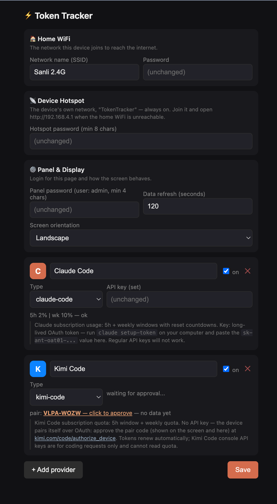

# esp32-token-tracker

A small desk display that shows how much of your AI coding quota is left,
before you hit the wall mid-session. Built on the ESP32-2432S028, the
"Cheap Yellow Display" you can get for about $10.

It currently tracks:

- **Claude Code** — 5h window + weekly limit, with reset countdowns
- **Kimi Code** — same idea, paired over OAuth right on the device

<!-- hero shot: device on desk showing the Claude page -->


Everything runs on the board itself. No companion app, no script on your
computer, nothing to keep running in the background. The ESP32 talks to the
provider APIs directly and draws the result.

## How it gets the numbers

This part took some digging, because neither provider has an official
"how much quota is left" API you can just call.

**Claude Code:** the official usage endpoint rate-limits you into oblivion
(see [claude-code#31637](https://github.com/anthropics/claude-code/issues/31637)),
so instead the device sends a 1-token message to the Messages API and reads
the `anthropic-ratelimit-unified-*` response headers. They carry both
utilization percentages and reset timestamps. You need a long-lived OAuth
token: run `claude setup-token` on your machine and paste the result into
the web panel.

**Kimi Code:** full OAuth device flow, on-device. The display shows a pair
code, you approve it at kimi.com in your browser, done. The refresh token
is stored in NVS and access tokens renew themselves. No key to paste at all.

<!-- photo: the pairing screen with a code on it -->


## Hardware

One ESP32-2432S028 (ILI9341 320x240 touch display, ESP32-WROOM). That's it.
The whole TFT_eSPI pin configuration lives in `platformio.ini`, so there is
no separate User_Setup.h to edit.

Touch is optional and sits behind a `FEATURE_TOUCH` build flag. Boards
without the touch controller build and run fine; you just lose tap-to-flip
between provider pages.

## Flashing

Standard PlatformIO:

```
pio run -t upload
```

Adjust `upload_port` in `platformio.ini` if your board shows up somewhere
other than `/dev/cu.usbserial-210`.

There are no secrets to configure before building. On first boot the device
generates a random password, stores it in NVS, and prints it on the setup
screen. The compiled firmware contains no credentials at all, so the same
binary is safe to share.

## First boot

The screen walks you through it:

<!-- photo: the SETUP screen with the 4 steps -->


1. Join the `TokenTracker` WiFi network (password is on the screen)
2. Open `http://192.168.4.1`
3. Log in as `admin` (same password)
4. Enter your home WiFi credentials and save

After that the device joins your network and the panel is reachable on your
LAN. The AP stays up as a fallback so you can always reach the config.

## The web panel

<!-- screenshot: the config panel in a browser -->


Providers can be added, toggled and renamed. Claude Code wants its OAuth
token pasted once; Kimi Code just shows pairing status and a re-pair button.
Rotation (portrait/landscape) and poll interval live here too.

There is also a `/screenshot` endpoint that reads the actual panel
framebuffer back over SPI and serves it as a BMP. Every screenshot in this
README that looks suspiciously pixel-perfect came from there.

## Adding a provider

The core knows nothing about any specific provider. Each one is a class
under `src/providers/<name>/` implementing `ProviderClient`:

- `fetch(p)` pulls the numbers
- `mode(p)` reports its state: waiting / connected / failed
- `usages(p)` returns what to render (progress bars, messages) as plain data
- `connect(screen, p)` draws its own onboarding screen if it needs one
- plus a logo bitmap and a brand color

Register the instance in `src/providers/registry.cpp` and you're done —
config seeding, the web panel and the display pick it up from there.

## Project layout

```
src/
  main.cpp            wifi + main loop
  core/               config, NVS persistence
  ui/                 display rendering, touch
  web/                config panel server
  net/                shared HTTPS/JSON client
  providers/          registry + one folder per provider
web/index.html        panel markup, embedded at link time
```
